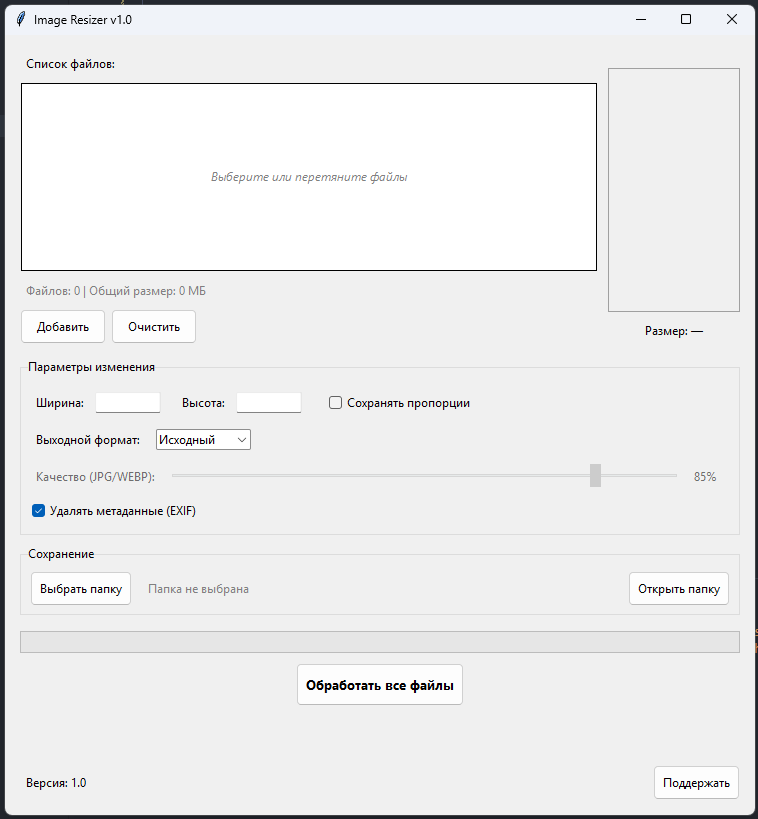

# OSRT - Open Source Resizing Tool

Программа с графическим интерфейсом на Python для пакетного изменения размеров изображений, конвертации форматов и очистки EXIF-метаданных. Поддерживает перетаскивание файлов (Drag-and-Drop) и асинхронную обработку.

---

## Скриншот

---

## 🚀 Запуск и установка

### Готовая сборка (для пользователей Windows)
1. Перейдите в раздел **Releases** справа и скачайте `OSRT.exe` (или архив с программой).
2. Запустите файл.

> **⚠️ Примечание для Windows Defender (SmartScreen):**
> При запуске `.exe` файла Защитник Windows может показать предупреждение. Это **ложное срабатывание**, так как программа распространяется с открытым исходным кодом и не имеет платной цифровой подписи.
> 
> **Как запустить:** Нажмите **«Подробнее»** (More info) $\rightarrow$ **«Выполнить в любом случае»** (Run anyway).
>
> ⚠️ Не доверяете .exe-сборке? Соберите приложение самостоятельно из исходного кода.
